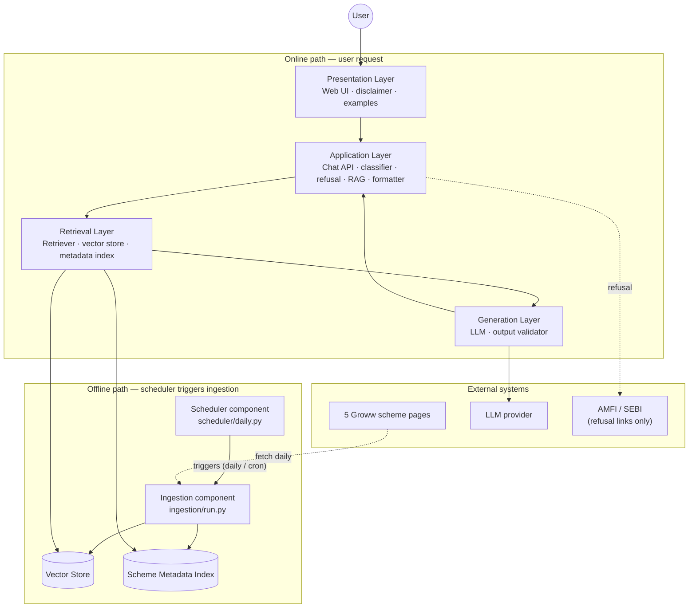
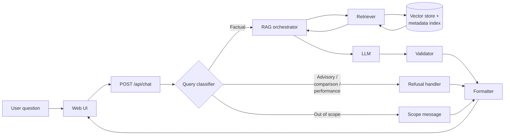
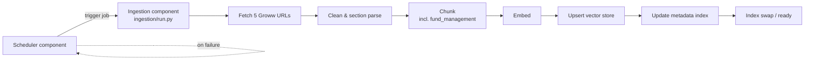
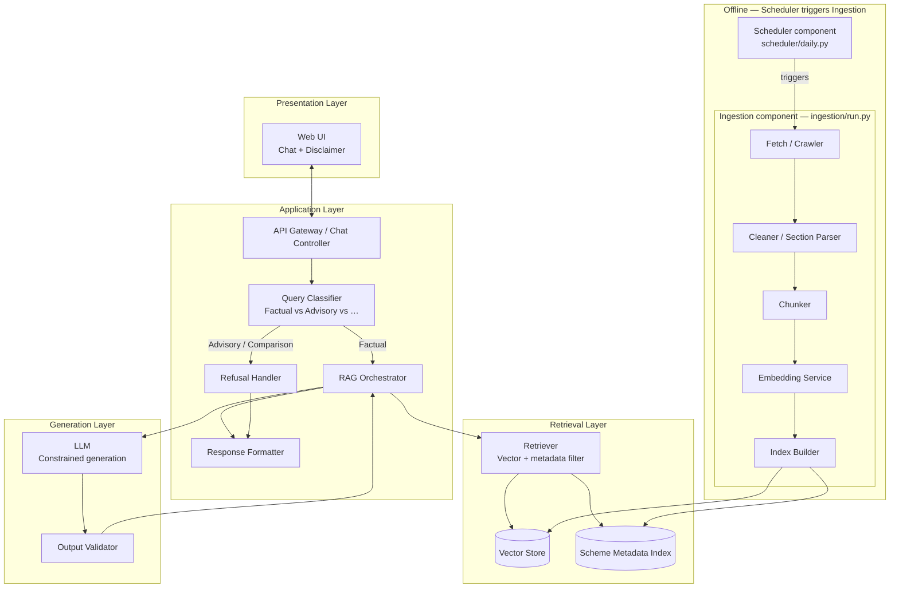
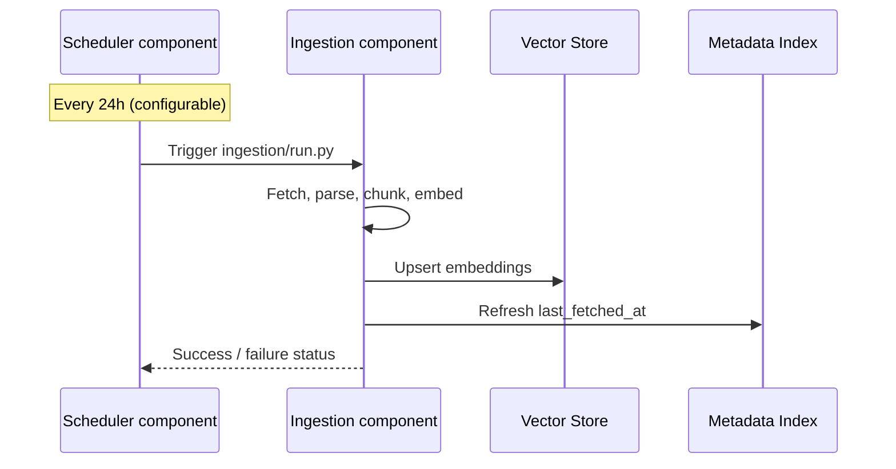
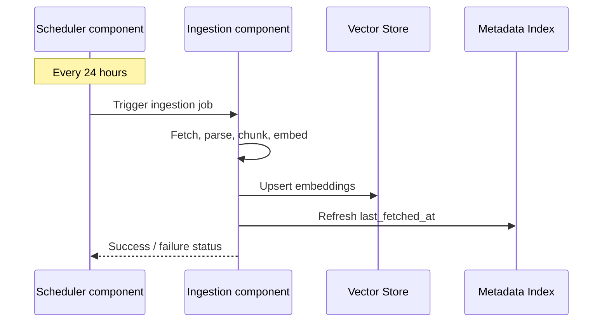

Architecture: Mutual Fund FAQ Assistant
This document describes the system architecture for a facts-only, RAG-based FAQ assistant scoped to five HDFC Mutual Fund scheme pages on Groww. It is derived from problemStatement.md.

1. Design Goals
Goal
Architectural implication
Facts-only answers
Retrieval grounded in corpus; LLM constrained by system prompt and post-generation validation
Source-backed responses
Every answer carries exactly one citation URL from the active corpus
Compliance
Advisory/comparison queries are classified and refused before or instead of retrieval
Accuracy over intelligence
Prefer retrieved text over model inference; narrow corpus (5 URLs) reduces hallucination risk
Transparency
Fixed response format: ≤3 sentences + citation + Last updated from sources: <date> footer
Privacy
Stateless chat; no PII collection or persistence

## 2. High-Level Architecture

The system is split into two independent paths: an **online request path** (user chat) and an **offline index path** (daily corpus refresh). Five vertical layers implement the online path. The offline path is driven by a **Scheduler** component that triggers the **Ingestion** component on a fixed cadence—the ingestion component then fetches, parses, chunks, embeds, and updates the retrieval stores. User chat requests never invoke ingestion directly.

### 2.1 Architecture overview

### 2.2 Layer stack

| Layer | Components | Responsibility |
|-------|------------|----------------|
| **Presentation** | Web UI (chat + disclaimer) | Welcome message, three example questions, free-text input, render answer + citation + footer; no PII fields |
| **Application** | Chat controller, query classifier, refusal handler, RAG orchestrator, response formatter | Route requests; block advisory/comparison before RAG; orchestrate factual flow; enforce ≤3 sentences, one link, footer |
| **Retrieval** | Retriever, vector store, scheme metadata index | Resolve scheme (1 of 5); filter by section (e.g. `fund_management`); semantic top-k over chunks |
| **Generation** | LLM, output validator | Grounded answer from retrieved context only; validate citations, grounding, compliance |
| **Scheduler** | `scheduler/daily.py` (cron, APScheduler, GitHub Actions, or cloud scheduler) | Fires on schedule; **triggers** the ingestion component; logs job status |
| **Ingestion** | `ingestion/run.py` + fetch, parse, chunk, embed, index modules | Runs only when triggered by scheduler (or manual CLI); updates vector store and metadata index |

### 2.3 Online path (request flow)

Applies to every user message at runtime.

**Steps:**

1. User submits a question in the chat UI.
2. **Chat controller** receives `{ "message": string }` (stateless; no identity).
3. **Query classifier** labels the query: factual, advisory, comparison, performance-seeking, or out of scope.
4. **Factual branch:** RAG orchestrator → retriever (scheme + section) → LLM with chunks → validator → formatter.
5. **Non-factual branch:** Refusal handler (or scope template) → formatter; no vector search; AMFI/SEBI link only.
6. **Formatter** returns JSON: `answer`, `citation_url`, `last_updated`, `is_refusal`, `disclaimer`.
7. UI displays the response with a single citation link and `Last updated from sources: <date>` footer.

### 2.4 Offline path (index flow)

Runs when the **scheduler** triggers the **ingestion component** (daily by default, or via manual CLI)—never on each chat request.

**Steps:**

1. **Scheduler component** fires at configured time (e.g. 02:00 UTC) and invokes the ingestion entrypoint (`ingestion/run.py`).
2. **Ingestion component** runs the pipeline: **fetch** all five HDFC scheme pages from Groww.
3. **Parse** into tagged sections: overview, expense_ratio, exit_load, minimum_investment, benchmark, tax, **fund_management**, investment_objective, fund_house.
4. **Chunk** (~200–400 tokens); keep each fund manager bio intact in `fund_management` chunks.
5. **Embed** and **upsert** vector store; refresh `last_fetched_at` in metadata index.
6. **Swap** index atomically; report success/failure back to scheduler logs; online API continues serving the previous index until swap completes.

### 2.5 Component map (by layer)

### 2.6 Path summary

| Path | Trigger | Flow | Output |
|------|---------|------|--------|
| **Online** | User message | Classify → retrieve → generate → validate → format → display | Facts-only answer or refusal JSON |
| **Offline** | **Scheduler** → **Ingestion component** (or manual CLI) | Scheduler triggers ingestion → fetch → parse → chunk → embed → index | Updated vector store + metadata for 5 schemes |

### 2.7 Scheduler and ingestion components

The offline path uses **two separate components** with a one-way trigger relationship:

| Component | Location | Role |
|-----------|----------|------|
| **Scheduler** | `scheduler/daily.py` | Time-based trigger only; does not fetch or parse pages itself |
| **Ingestion** | `ingestion/run.py` (+ `fetch.py`, `parse.py`, `chunk.py`, `index.py`) | Full corpus refresh pipeline; executed when scheduler (or operator) invokes it |

- **Scheduler responsibilities:** schedule definition, invoke ingestion entrypoint, log start/end, optional single retry on failure.
- **Ingestion responsibilities:** all data work (Groww fetch through index swap).
- **Manual override:** `python ingestion/run.py` (or equivalent) bypasses the scheduler for ad-hoc refreshes.
- **Chat API:** never calls the scheduler or ingestion; it only reads the current index.

**Design principle:** Compliance and routing happen in the **application layer** before retrieval. The **retrieval** and **generation** layers only run for **factual** queries about the five-scheme corpus, including fund management questions.

---

## 3. System Components
3.1 Presentation Layer (Minimal UI)
A lightweight single-page chat interface inspired by Groww's mutual fund detail pages as reference context.
Responsibilities:
Display welcome message and disclaimer: "Facts-only. No investment advice."
Show three clickable example questions (covering scheme facts and fund management)
Accept free-text user queries
Render assistant replies with citation link and last-updated footer
Never prompt for or accept PII (PAN, Aadhaar, account numbers, OTP, email, phone)
Suggested example questions:
What is the expense ratio of HDFC Mid Cap Fund Direct Growth?
What is the exit load on HDFC Defence Fund Direct Growth?
Who manages HDFC Gold ETF Fund of Fund Direct Plan Growth?

3.2 Application Layer
Chat Controller
Exposes a single endpoint, e.g. POST /api/chat
Accepts { "message": string } only — no session identifiers tied to identity
Routes to classifier, then RAG or refusal path
Returns structured JSON for the UI to render
{
  "answer": "The expense ratio of HDFC Mid Cap Fund Direct Growth is 0.73%.",
  "citation_url": "https://groww.in/mutual-funds/hdfc-mid-cap-fund-direct-growth",
  "last_updated": "2026-05-29",
  "is_refusal": false
}

Query Classifier
Runs before retrieval to enforce compliance.
Class
Examples
Action
Factual
Expense ratio, exit load, min SIP, benchmark, fund manager name/tenure/experience
Proceed to RAG
Advisory
"Should I invest?", "Is this a good fund?"
Refusal handler
Comparison
"Which fund is better?", "Mid cap vs large cap?"
Refusal handler
Performance-seeking
"What returns will I get?", "Compare 3Y returns"
Refusal or link-only response to scheme page
Out of scope
Schemes not in corpus, unrelated topics
Polite refusal with scope explanation

Implementation options (in order of simplicity):
Rule-based keyword/pattern matcher for advisory and comparison phrases
Lightweight LLM classification with a fixed label set
Hybrid: rules first, LLM fallback for ambiguous cases
Refusal Handler
Produces a polite, templated response when classification blocks RAG:
States the facts-only limitation
Does not retrieve or invent fund data
Includes one educational link (AMFI or SEBI), e.g.:
AMFI — Mutual Funds
SEBI — Investor Education
RAG Orchestrator
Coordinates retrieval, prompt assembly, generation, and validation for factual queries.
Response Formatter
Enforces output contract:
Maximum 3 sentences in the answer body
Exactly one citation_url (must match one of the 5 corpus URLs when answering from corpus)
Footer: Last updated from sources: <date> where <date> comes from chunk metadata (page fetch or parse timestamp), not model inference

3.3 Retrieval Layer
Corpus (Active)
Scheme
Source URL
HDFC Mid Cap Fund Direct Growth
https://groww.in/mutual-funds/hdfc-mid-cap-fund-direct-growth
HDFC Large Cap Fund Direct Growth
https://groww.in/mutual-funds/hdfc-large-cap-fund-direct-growth
HDFC Small Cap Fund Direct Growth
https://groww.in/mutual-funds/hdfc-small-cap-fund-direct-growth
HDFC Gold ETF Fund of Fund Direct Plan Growth
https://groww.in/mutual-funds/hdfc-gold-etf-fund-of-fund-direct-plan-growth
HDFC Defence Fund Direct Growth
https://groww.in/mutual-funds/hdfc-defence-fund-direct-growth

Scheme Metadata Index
A small lookup table (JSON or embedded DB) keyed by scheme name / slug:
{
  "slug": "hdfc-mid-cap-fund-direct-growth",
  "scheme_name": "HDFC Mid Cap Fund Direct Growth",
  "category": "Equity — Mid Cap",
  "source_url": "https://groww.in/mutual-funds/hdfc-mid-cap-fund-direct-growth",
  "last_fetched_at": "2026-05-29"
}

Used to:
Resolve which scheme the user is asking about
Pre-filter retrieval to a single scheme when detected
Attach the correct citation URL
Vector Store
Stores embedded text chunks with rich metadata:
Metadata field
Purpose
source_url
Citation link
scheme_name
Scheme disambiguation
section
e.g. expense_ratio, exit_load, fund_management, benchmark
last_updated
Footer date
chunk_text
Raw passage for grounding

Recommended stores for a lightweight build: Chroma, FAISS, or LanceDB (local, file-backed).
Retriever
Two-stage retrieval for better precision on a small corpus:
Scheme resolution — Match user query to one of five schemes via slug, name, or alias (e.g. "mid cap", "defence fund")
Semantic search — Top-k chunks (k=3–5) filtered by source_url or scheme_name, optionally boosted by section if query intent is detected (e.g. "fund manager" → boost fund_management)
Because the corpus is tiny (~5 pages), a hybrid approach is viable: metadata filter first, then vector similarity within that subset.

3.4 Generation Layer
LLM (Constrained Generation)
The model receives:
System prompt: facts-only, no advice, use only provided context, max 3 sentences
Retrieved chunks with source URLs and dates
User question
Hard rules in the prompt:
Answer only from retrieved context; if context is insufficient, say so and point to the scheme page
Do not compare funds or compute returns
Do not recommend buy/sell/hold
Include no more than one URL in the answer (formatter may extract citation separately)
Output Validator
Post-generation checks before returning to the user:
Check
Failure action
Answer ≤ 3 sentences
Truncate or regenerate
Citation URL in allowlist
Replace with best matching corpus URL from retrieved chunks
No advisory language detected
Route to refusal template
Grounding: key facts appear in retrieved chunks
Regenerate or fallback to link-only response
Performance numbers not quoted (unless user asked for link)
Strip or refuse

3.5 Ingestion Component (Offline)
The **ingestion component** (`ingestion/run.py`) performs all corpus refresh work. It does **not** run on its own schedule—it is **triggered by the scheduler component** (see §3.6) once per day, or started manually via CLI. It is never invoked by user chat requests.

Ingestion pipeline (executed inside the ingestion component):
Fetch 5 Groww URLs
Parse HTML / Markdown
Extract Sections
Chunk Text
Generate Embeddings
Upsert Vector Store
Update Metadata Index

Ingestion steps
Fetch — HTTP GET each corpus URL; store raw HTML or converted markdown with fetch timestamp
Clean & parse — Remove navigation, footers, and duplicate chrome; retain scheme-specific sections
Section extraction — Map content into logical blocks aligned with FAQ query types:
Section tag
Example content
overview
Category, risk label, AUM, NAV date
expense_ratio
Expense ratio value and definition
exit_load
Load structure and effective dates
minimum_investment
Min SIP, first/second investment
benchmark
Benchmark index name
tax
STCG/LTCG implications (factual only)
fund_management
Manager name, tenure, education, experience, other schemes
investment_objective
Stated objective from scheme description
fund_house
AMC name, website, incorporation date

Chunking — Section-aware chunks (~200–400 tokens) with overlap only within the same section; keep fund manager bios intact in fund_management chunks
Embed — Use a consistent embedding model (e.g. text-embedding-3-small, nomic-embed-text, or equivalent open-source model)
Index — Upsert into vector store; refresh last_fetched_at in metadata index

3.6 Scheduler Component
A dedicated **scheduler component** (`scheduler/daily.py`) runs separately from ingestion. Its sole job is to **trigger the ingestion component** on a fixed daily cadence so the vector store and metadata index stay aligned with the latest Groww scheme pages. The scheduler does not fetch URLs or build embeddings itself.

Responsibilities:
Fire at a configured time each day (e.g. 02:00 UTC / off-peak hours)
Trigger the ingestion component by invoking ingestion/run.py (or equivalent) as a single atomic job
Log start time, completion status, URLs fetched, and chunk count returned from ingestion
On ingestion failure, record error details and optionally re-trigger ingestion once before alerting
Implementation options:
Option
Use case
Cron (Linux/macOS crontab or container cron)
Simple VM / bare-metal deployment
APScheduler (embedded in a worker process)
Single-process Python deployment
GitHub Actions scheduled workflow
Repo-hosted corpus refresh with no dedicated worker
Cloud scheduler (AWS EventBridge, GCP Cloud Scheduler)
Managed production environments

Scheduler → ingestion flow:

The online chat API is not blocked during ingestion; retrieval continues to serve the previous index until the ingestion component has fully written and swapped in the new index.

4. End-to-End Request Flow
FormatterValidatorLLMRetrieverRAG OrchestratorRefusal HandlerQuery ClassifierChat ControllerWeb UIFormatterValidatorLLMRetrieverRAG OrchestratorRefusal HandlerQuery ClassifierChat ControllerWeb UIalt[Advisory or comparison][Factual]UserAsk questionPOST /api/chatClassify queryBlock RAGRefusal + AMFI/SEBI linkProceedResolve scheme + retrieve chunksTop-k chunks + metadataPrompt with contextDraft answerValidate grounding & complianceApproved text + citation + dateStructured responseAnswer + citation + footerUser

5. Data Model
Chunk record (vector store document)
id: hdfc-mid-cap-fund-direct-growth#fund_management#0
text: |
  Chaitanya Choksi — Fund Manager, Feb 2023 - Present.
  Education: B.Com, CA. Experience: Prior to HDFC AMC...
scheme_name: HDFC Mid Cap Fund Direct Growth
source_url: https://groww.in/mutual-funds/hdfc-mid-cap-fund-direct-growth
section: fund_management
last_updated: "2026-05-29"
embedding: [ ... ]

Chat request / response (API contract)
Request:
{ "message": "Who manages HDFC Defence Fund?" }

Response (factual):
{
  "answer": "HDFC Defence Fund Direct Growth is managed by Priya Ranjan (since Apr 2025), Dhruv Muchhal (since Jun 2023), and Rahul Baijal (since Apr 2025). Manager profiles and tenure are listed on the scheme page.",
  "citation_url": "https://groww.in/mutual-funds/hdfc-defence-fund-direct-growth",
  "last_updated": "2026-05-29",
  "is_refusal": false,
  "disclaimer": "Facts-only. No investment advice."
}

Response (refusal):
{
  "answer": "I can only answer factual questions about HDFC schemes in my corpus, such as expense ratio, exit load, or fund manager details. I cannot provide investment advice or recommend which fund to choose.",
  "citation_url": "https://www.amfiindia.com/investor",
  "last_updated": "2026-05-29",
  "is_refusal": true,
  "disclaimer": "Facts-only. No investment advice."
}

6. Query Routing Matrix
User intent
Classifier label
Retrieval
Generation behavior
Expense ratio of a named scheme
Factual
Filter by scheme → expense_ratio section
State ratio from chunk
Exit load
Factual
exit_load section
State load rules
Minimum SIP
Factual
minimum_investment section
State amounts
Benchmark
Factual
benchmark section
State index name
Fund manager / tenure / experience
Factual
fund_management section
List managers and bios factually
Should I invest?
Advisory
None
Refusal + AMFI/SEBI link
Which fund is better?
Comparison
None
Refusal + educational link
Expected returns / past performance comparison
Performance
None or link-only
Refuse calculation; cite scheme page URL only
Unknown scheme (not in corpus)
Out of scope
None
Explain limited corpus; list supported schemes

7. Technology Stack (Recommended)
Layer
Options
Rationale
Frontend
React / Next.js or plain HTML+JS
Minimal chat UI, fast to ship
Backend
Python (FastAPI) or Node (Express)
Strong RAG ecosystem in Python
Embeddings
BGE-small-en-v1.5 (local, sentence-transformers)
Free; sufficient for 51 short factual chunks
Vector DB
ChromaDB (local persistent)
Metadata filtering, upsert, 51-chunk corpus
LLM
GPT-4o-mini, Claude Haiku, or local Llama
Cost-effective for short answers
Ingestion
BeautifulSoup / Playwright + markdown converter
Parse Groww scheme pages
Config
Environment variables for API keys and corpus URLs
No secrets in repo

8. Security, Privacy & Compliance
Blocked / Not Stored
Allowed
Reject input patterns
Reject input patterns
Classifier
Anonymous factual questions
Corpus URLs only
PAN, Aadhaar, account #, OTP
Email, phone
Investment advice generation
RAG Pipeline
No processing
Refusal
Stateless API — No user accounts, chat history persistence, or analytics tied to identity (optional ephemeral in-memory UI history is acceptable)
Input sanitization — Reject or strip patterns resembling PII before LLM call
Allowlist citations — Validator ensures answer citations are corpus URLs (or fixed AMFI/SEBI URLs for refusals)
No training on user data — Queries are not used to fine-tune models in this phase
Rate limiting — Basic per-IP limits to prevent abuse and cost overrun

9. Deployment Topology
Development (local):
[Browser] → [FastAPI :8000] → [Chroma (local disk)] → [LLM API]
                ↑
         [Scheduler component] --triggers--> [Ingestion component / ingestion/run.py]

Production (minimal):
[Browser] → [Static UI (CDN/Vercel)] → [API (container/VM)] → [Vector DB volume]
                                              ↓
                                        [LLM provider]

[Scheduler component (cron / APScheduler / GitHub Actions / cloud scheduler)]
        | triggers
        v
[Ingestion component] → rebuild index → Vector DB volume

Corpus refresh: The scheduler component triggers the ingestion component once daily; ingestion rebuilds the vector store and metadata index from live Groww URLs
Manual re-run: invoke ingestion/run.py directly (bypasses scheduler) for ad-hoc refreshes
Environment separation: dev uses cached markdown snapshots; prod refreshes from live Groww URLs

10. Non-Functional Requirements
Attribute
Target
Latency (p95)
< 5 s end-to-end (including LLM)
Availability
Best-effort for demo; no SLA in phase 1
Corpus size
Fixed 5 URLs; ~50–150 chunks total
Ingestion cadence
Scheduler component triggers ingestion component daily (automatic corpus refresh)
Answer length
≤ 3 sentences + 1 link + footer
Observability
Log query class, scheme resolved, retrieval scores, refusal rate (no PII)

11. Known Limitations
Corpus scope — Only five HDFC schemes on Groww; no AMFI/SEBI document ingestion in this phase
Source freshness — Answers reflect the last successful daily ingestion run; intra-day Groww updates are picked up on the next scheduled run
Third-party source — Groww is used as reference context, not HDFC AMC primary documents (KIM/SID/factsheets)
No performance analytics — Return comparisons and projections are explicitly out of scope
Scheme disambiguation — Ambiguous queries (e.g. "HDFC fund expense ratio" without naming the scheme) may require clarification or return the most similar scheme
Fund management completeness — Manager data is limited to what appears on each Groww scheme page
Document download guides — Not in current corpus unless added to a future URL list

12. Future Extensions (Out of Current Scope)
Expand corpus to 15–25 official AMC / AMFI / SEBI URLs
Add clarification turn: "Which scheme did you mean?"
Structured extraction cache (JSON facts per scheme) for numeric fields like expense ratio
Multilingual support (Hindi)
Admin dashboard for ingestion status and chunk inspection

13. Project Structure (Suggested)
m2_4/
├── docs/
│   ├── problemStatement.md
│   └── architecture.md          # this document
├── data/
│   ├── raw/                     # fetched HTML/markdown per URL
│   ├── processed/               # parsed sections & chunks
│   └── index/                   # vector store files
├── ingestion/
│   ├── fetch.py
│   ├── parse.py
│   ├── chunk.py
│   ├── index.py
│   └── run.py                   # ingestion component entrypoint (triggered by scheduler)
├── scheduler/
│   └── daily.py                 # scheduler component — triggers ingestion/run.py
├── app/
│   ├── main.py                  # FastAPI entry
│   ├── classifier.py
│   ├── retriever.py
│   ├── generator.py
│   ├── validator.py
│   └── formatter.py
├── ui/
│   └── index.html               # minimal chat UI
├── config/
│   └── corpus.yaml              # 5 URLs + scheme metadata
├── tests/
│   ├── test_classifier.py
│   ├── test_retrieval.py
│   └── test_refusal.py
└── README.md

14. Summary
The Mutual Fund FAQ Assistant is a small-corpus, compliance-first RAG system. A query classifier gates advisory and comparison questions before retrieval. Factual questions flow through scheme-aware retrieval over five indexed Groww pages, grounded LLM generation, and a strict response formatter that enforces brevity, a single citation, and a last-updated footer. A scheduler component triggers the ingestion component on a daily cadence to keep embeddings and metadata in sync with the defined corpus. The architecture prioritizes verifiability and refusal correctness over open-ended conversational ability.
