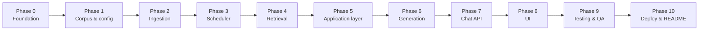

# Phase-Wise Implementation Plan: Mutual Fund FAQ Assistant

This plan translates [ProblemStatement.md](./ProblemStatement.md) and [architecture.md](./architecture.md) into a sequenced build roadmap. Each phase has clear goals, tasks, deliverables, and exit criteria before moving to the next phase.

---

## Document references

| Document | Purpose |
|----------|---------|
| [ProblemStatement.md](./ProblemStatement.md) | Scope, corpus, FAQ rules, UI, success criteria |
| [architecture.md](./architecture.md) | Layers, components, scheduler → ingestion, API contract |

---

## Implementation overview



| Phase | Focus | Est. duration |
|-------|--------|---------------|
| 0 | Project foundation | 1–2 days |
| 1 | Corpus configuration & data model | 1 day |
| 2 | Ingestion component | 4–6 days |
| 3 | Scheduler component | 1–2 days |
| 4 | Retrieval layer | 2–3 days |
| 5 | Application layer (classifier, refusal, RAG, formatter) | 3–4 days |
| 6 | Generation layer (LLM + validator) | 2–3 days |
| 7 | Chat API integration | 1–2 days |
| 8 | Presentation UI | 2–3 days |
| 9 | Testing & compliance validation | 3–4 days |
| 10 | Deployment, observability, README | 2–3 days |

**Total (indicative):** ~3–4 weeks for a single developer.

---

## Phase 0: Project foundation

### Goal

Establish repository structure, dependencies, environment configuration, and development conventions aligned with the architecture project layout.

### Tasks

- [x] Create directory structure per architecture §13:
  - `app/`, `ingestion/`, `scheduler/`, `ui/`, `config/`, `data/{raw,processed,index}`, `tests/`
- [x] Initialize Python project (`pyproject.toml` or `requirements.txt`)
  - FastAPI, uvicorn, chromadb, sentence-transformers (or OpenAI client), httpx, beautifulsoup4, pyyaml, pydantic, pytest
- [x] Add `.env.example` for `LLM_API_KEY`, `EMBEDDING_MODEL`, `CHROMA_PATH`, schedule time
- [x] Add `.gitignore` (`data/index/`, `.env`, `__pycache__`)
- [x] Create empty `README.md` stub with links to DOCS
- [x] Optional: Docker Compose skeleton for API + volume mount for Chroma

### Deliverables

- Runnable `python -m app.main` (health endpoint only)
- Documented setup steps in README (partial)

### Exit criteria

- [x] `GET /health` returns 200
- [x] All team members can install deps and run API locally

### Maps to

- Architecture: project structure, tech stack §7
- Problem statement: expected README deliverable (started)

---

## Phase 1: Corpus configuration & data model

### Goal

Define the five-scheme corpus, metadata schema, citation allowlists, and refusal URLs in configuration—no ingestion yet.

### Tasks

- [x] Create `config/corpus.yaml` with:
  - All 5 scheme names, slugs, `source_url`, categories, aliases (e.g. `mid cap`, `defence fund`, `gold etf fof`)
  - Section tag enum: `overview`, `expense_ratio`, `exit_load`, `minimum_investment`, `benchmark`, `tax`, `fund_management`, `investment_objective`, `fund_house`
  - AMFI/SEBI refusal URLs (fixed allowlist)
- [x] Implement `config/loader.py` to load and validate corpus config
- [x] Define Pydantic models:
  - `SchemeMetadata`, `ChunkRecord`, `ChatRequest`, `ChatResponse`
- [x] Document chunk ID format: `{slug}#{section}#{index}` or `{slug}#fund_management#{manager-slug}`
- [x] Seed `data/` README explaining raw / processed / index folders

### Deliverables

- `config/corpus.yaml` (5 URLs from problem statement §1)
- Shared models importable by ingestion and app

### Exit criteria

- [x] Config loads without error; all 5 URLs present
- [x] Unit test: citation allowlist contains exactly 5 Groww URLs + AMFI/SEBI refusal URLs

### Maps to

- Problem statement: corpus definition, constraints (answer vs refusal sources)
- Architecture: §3.3 corpus table, §5 data model

---

## Phase 2: Ingestion component

### Goal

Build `ingestion/run.py` and submodules to fetch, parse, chunk, embed, and index all five Groww pages—including **fund_management** sections with intact manager bios.

### Tasks

#### 2.1 Fetch (`ingestion/fetch.py`)

- [x] HTTP GET each corpus URL from `corpus.yaml`
- [x] Store raw HTML under `data/raw/{slug}.html` with `fetch_timestamp`
- [x] Dev mode: support reading cached markdown snapshots (e.g. uploaded `.md` files) when `USE_CACHE=true`
- [x] Handle fetch failures per URL (log, continue others, exit non-zero if all fail)

#### 2.2 Parse (`ingestion/parse.py`)

- [x] Strip nav, footer, calculators, holdings tables (not needed for FAQ)
- [x] Extract sections into structured JSON per scheme under `data/processed/{slug}.json`
- [x] **Fund management:** one block per manager (name, tenure, education, experience)
- [x] Map sections per architecture §3.5 table

#### 2.3 Chunk (`ingestion/chunk.py`)

**Strategy: section-first chunking (hierarchical, not page-level fixed windows)**

| Rule | Detail |
|------|--------|
| Default unit | One chunk per parsed **section** when text ≤ ~400 tokens (~1,600 chars) |
| `fund_management` | **One chunk per manager** using `manager.text`; ID `{slug}#fund_management#{manager-slug}` |
| Oversized sections only | Split **inside** the same section with ~50-token overlap (~200 chars); never merge sections |
| Skip empty | No chunk for sections with blank text after parse/clean |
| Embed text prefix | `Scheme: … / Section: … / Source: …` then body (improves retrieval) |
| IDs | General: `{slug}#{section}#{index}`; managers: see `config/chunk_ids.py` |

Expected corpus size: **~45–55 chunks** (5 schemes × ~9–11 chunks), within the ~50–150 target.

- [x] Section-first chunks (~200–400 tokens; split only when a section exceeds cap)
- [x] Overlap only within same section (paragraph/sentence-aware split)
- [x] **One chunk per manager** in `fund_management`
- [x] Attach metadata: `source_url`, `scheme_name`, `section`, `last_updated`, optional `manager_name`
- [x] Optional artifact: `data/processed/{slug}.chunks.json`

#### 2.4 Embed & index (`ingestion/index.py`)

- [x] Embed chunks (`EMBEDDING_MODEL`, default `BAAI/bge-small-en-v1.5` via `sentence-transformers` when `EMBEDDING_PROVIDER=local`)
- [x] Upsert into ChromaDB persistent collection under `data/index/chroma/`
- [x] Write/update scheme metadata JSON index (`data/index/metadata.json`)
- [x] Blue-green write: build under `data/index/chroma_staging/`, swap into `CHROMA_PATH` on success

#### 2.5 Entrypoint (`ingestion/run.py`)

- [x] CLI: `python ingestion/run.py` runs full pipeline (fetch → parse → chunk → embed → index)
- [x] Log: URLs fetched, chunk count per scheme/section, duration, exit code
- [x] Return structured `IngestionRunResult` for scheduler (success/failure, stats)

### Deliverables

- Working ingestion pipeline runnable via CLI
- Populated vector store (~50–150 chunks) and metadata index

### Exit criteria

- [x] `python ingestion/run.py` completes for all 5 schemes
- [x] Manual spot-check: `fund_management` chunks exist for Mid Cap, Gold ETF FoF, Defence
- [x] Spot-check: `expense_ratio`, `exit_load`, `minimum_investment` chunks present per scheme
- [x] `last_fetched_at` set on metadata index

### Maps to

- Problem statement: corpus content types, fund management requirement
- Architecture: §2.4 offline path, §3.5 ingestion component

### Test cases (manual)

| Query type | Verify chunk exists |
|------------|---------------------|
| Expense ratio | Mid Cap `expense_ratio` |
| Exit load | Defence `exit_load` |
| Fund managers | Gold ETF FoF `fund_management` (≥2 managers) |

---

## Phase 3: Scheduler component

### Goal

Implement `scheduler/daily.py` that **triggers** the ingestion component on a schedule—scheduler does not fetch or parse data itself.

### Tasks

- [x] Implement `scheduler/daily.py`:
  - Invoke `ingestion/run.py` as subprocess or callable
  - Log start time, end time, exit code, ingestion stats
  - Optional: single retry on failure
- [x] Support trigger modes:
  - **APScheduler** embedded (dev)
  - **Cron** documentation for production (`scheduler/README.md`)
  - **Manual:** `python scheduler/daily.py --once` for testing
- [x] Config: `INGESTION_SCHEDULE_CRON` or `SCHEDULE_HOUR_UTC` in env
- [x] Ensure chat API never imports or calls scheduler/ingestion

### Deliverables

- [x] `scheduler/daily.py` with documented run instructions (`scheduler/README.md`)
- [x] JSON job log line on stdout; optional `SCHEDULER_LOG_PATH`

### Exit criteria

- [x] `python scheduler/daily.py --once` triggers ingestion and logs success/failure
- [x] Scheduler does not contain fetch/parse/embed logic (only triggers `ingestion/run.py`)
- [x] Documented: online API unaffected during ingestion (serves previous index until swap)

### Maps to

- Architecture: §2.7 scheduler and ingestion components, §3.6 scheduler component

---

## Phase 4: Retrieval layer

### Goal

Implement **metadata-first hybrid retrieval** over the indexed corpus (~49 chunks): resolve scheme and section with rules, use Chroma filters first, semantic search only as a slug-scoped fallback.

### Retrieval strategy (decided from chunk + embedding design)

| Stage | Method | Notes |
|-------|--------|--------|
| **1. Scheme** | Rules on `metadata.json` + `corpus.yaml` aliases | Longest alias wins; slug/scheme_name match; other AMC without “hdfc” → `out_of_scope`; no/weak match → `scheme_ambiguous` |
| **2. Section** | Keyword rules | Specific before general (e.g. fund manager before overview) |
| **3a. Direct** | Chroma `get` with `slug` + `section` | Default for factual sections; expect 1 chunk; score = 1.0 |
| **3b. Fund management** | Chroma `get` with `slug` + `fund_management` | Return **all** manager chunks (cap 5); optional filter by `manager_name` |
| **3c. Semantic fallback** | Query embed + Chroma `query` with `where slug` only | k=3–5; BGE query prefix; min similarity 0.35; section score boost ×1.2 |

**Never** search all 49 chunks without a `slug` filter. Query embeddings: same model as index (`BAAI/bge-small-en-v1.5`) with BGE query instruction prefix.

### Tasks

- [x] Implement `app/embeddings.py` — `embed_query()` with BGE query prefix
- [x] Implement `app/retriever.py`:
  - Load Chroma collection and metadata index
  - **Stage 1:** Resolve scheme from query (name, slug, alias; out-of-scope / ambiguous flags)
  - **Stage 2:** Detect section intent (rules: fund manager → `fund_management`, etc.)
  - **Stage 3:** Metadata filter first; slug-scoped semantic top-k (k=3–5) as fallback
  - For fund-management queries: retrieve all `fund_management` chunks for resolved scheme (up to cap)
- [x] Handle out-of-scope / ambiguous scheme via `RetrievalResult` flags
- [x] Expose `retrieve(query) -> RetrievalResult` with `ScoredChunk` list

### Deliverables

- `app/embeddings.py`, `app/retriever.py` + unit tests `tests/test_retrieval.py`

### Exit criteria

- [x] “Expense ratio HDFC Mid Cap” → `expense_ratio` chunks for Mid Cap
- [x] “Who manages HDFC Defence Fund?” → all `fund_management` chunks for Defence
- [x] “Who manages HDFC Gold ETF Fund of Fund?” → Gold ETF FoF managers
- [x] Unknown scheme → no corpus match / out-of-scope signal

### Maps to

- Problem statement: factual query types, fund management
- Architecture: §3.3 retriever, metadata-first hybrid retrieval

---

## Phase 5: Application layer

### Goal

Implement query classification, refusal handling, RAG orchestration, and response formatting before LLM is fully wired (can use stub generator initially).

### Tasks

#### 5.1 Classifier (`app/classifier.py`)

- [x] Rule-based patterns for: advisory, comparison, performance-seeking
- [x] Scheme allowlist check → factual vs out-of-scope
- [x] Labels: `factual`, `advisory`, `comparison`, `performance`, `out_of_scope`
- [x] Tests: `tests/test_classifier.py`

#### 5.2 Refusal handler (`app/refusal.py`)

- [x] Templates for advisory/comparison (polite, facts-only message)
- [x] One AMFI or SEBI `citation_url` from config
- [x] `is_refusal: true`; no retrieval

#### 5.3 Response formatter (`app/formatter.py`)

- [x] Enforce ≤3 sentences
- [x] Exactly one `citation_url`
- [x] Disclaimer from corpus config (`Facts-only. No investment advice.`)
- [x] `last_updated` from chunk metadata (not LLM)
- [x] Build `ChatResponse` JSON

#### 5.4 RAG orchestrator (`app/rag.py` + `app/stub_generator.py`)

- [x] Wire: classifier → (retriever + stub generator) → formatter
- [x] Out-of-scope template listing five supported schemes

### Deliverables

- [x] `app/classifier.py`, `app/refusal.py`, `app/formatter.py`, `app/rag.py`, `app/stub_generator.py`
- [x] Tests: `tests/test_classifier.py`, `tests/test_refusal.py`, `tests/test_rag.py`

### Exit criteria

- [x] “Should I invest?” → refusal, no retriever call
- [x] “Which fund is better?” → refusal
- [x] “What returns will I get?” → performance handling (refusal)
- [x] Out-of-scope scheme → lists five schemes

### Maps to

- Problem statement: §3 refusal handling, output format
- Architecture: §3.2 application layer, query routing matrix §6

---

## Phase 6: Generation layer

### Goal

Add constrained LLM generation ( **Groq**, OpenAI-compatible API) and post-generation validation for factual queries.

### LLM provider: Groq

| Setting | Default | Purpose |
|---------|---------|---------|
| `LLM_API_KEY` | (required for live LLM) | Groq API key |
| `LLM_BASE_URL` | `https://api.groq.com/openai/v1` | OpenAI-compatible base URL |
| `LLM_MODEL` | `llama-3.3-70b-versatile` | Groq chat model |
| `LLM_PROVIDER` | `groq` | Documentation label; client uses `LLM_BASE_URL` |
| `USE_LLM_STUB` | `false` | If `true` or no API key, use `stub_generator` (tests/CI) |

Client: `openai` Python SDK pointed at Groq. Embeddings remain local BGE (Phase 2)—do not use Groq for embeddings unless configured separately.

### Tasks

- [x] Implement `app/generator.py`:
  - System prompt: facts-only, context-only, max 3 sentences, no advice/comparison/returns
  - Pass retrieved chunks with URLs and dates
  - Groq via OpenAI-compatible `chat.completions`
- [x] Implement `app/validator.py`:
  - ≤3 sentences
  - Citation in allowlist (5 Groww URLs) when draft contains URLs
  - Advisory phrase detection → refusal redirect
  - Grounding check (percentages, manager names in chunks)
  - No unsourced performance numbers
- [x] Integrate with RAG orchestrator (replace stub when API key present)
- [x] Regenerate once on validation failure; then stub/link-only fallback

### Deliverables

- [x] `app/generator.py`, `app/validator.py`, tests `tests/test_generator.py`, `tests/test_validator.py`

### Exit criteria

- [x] Factual answers grounded in retrieved chunks (validator + stub fallback)
- [x] Invalid citation replaced with chunk `source_url`
- [x] Fund management answer lists managers from chunks only (grounding check)
- [x] Advisory language in draft → refusal path

### Maps to

- Problem statement: facts-only, no performance comparisons
- Architecture: §3.4 generation layer

---

## Phase 7: Chat API integration

### Goal

Expose `POST /api/chat` as the single stateless endpoint wiring all application components.

### Tasks

- [x] Implement `app/main.py` (FastAPI):
  - `POST /api/chat` — body `{ "message": string }`
  - `GET /health` (includes `index_ready`)
  - `GET /api/schemes` — list five schemes for UI
- [x] Input sanitization: reject PII patterns (`app/security.py`) — PAN, Aadhaar, email, phone, OTP, long account numbers
- [x] Rate limiting (basic per-IP, `app/rate_limit.py`)
- [x] CORS for local UI
- [x] Structured logging: query class, scheme resolved, section, refusal flag (no message body in logs)

### Deliverables

- [x] Working API testable via `curl` / Postman
- [x] `tests/test_api_chat.py`, `tests/test_security.py`

### Exit criteria

- [x] End-to-end factual query returns valid `ChatResponse` JSON
- [x] Refusal and out-of-scope paths return correct shape
- [ ] p95 latency target: < 5 s (measure locally with Groq API)
- [x] API does not call scheduler or ingestion

### Maps to

- Architecture: API contract §5, online path §2.3
- Problem statement: privacy (no PII), transparency

### Sample acceptance requests

```json
{ "message": "What is the expense ratio of HDFC Mid Cap Fund Direct Growth?" }
{ "message": "Who manages HDFC Gold ETF Fund of Fund Direct Plan Growth?" }
{ "message": "Should I invest in HDFC Defence Fund?" }
```

---

## Phase 8: Presentation UI

### Goal

Deliver minimal chat UI per problem statement §4.

### Tasks

- [x] Build primary UI in `frontend/` (Next.js + React + Tailwind — **FundFacts Assistant**):
  - Welcome message with supported schemes list
  - Visible disclaimer: **“Facts-only. No investment advice.”** (sticky red footer)
  - Three clickable example questions (expense ratio, exit load, **fund management**)
  - Chat input (no PII-specific fields) + privacy notice
  - Render: answer (≤3 sentences), single citation link (`Source` / `Learn more`), `Last updated from sources: <date>` footer
- [x] Legacy fallback: `ui/index.html` (+ `ui/app.js`, `ui/styles.css`) served at `/` when only API runs
- [x] Call `POST /api/chat` on submit (Next.js rewrites `/api/*` → FastAPI in dev)
- [x] Handle loading and error states
- [x] Dark-theme UI per design mockup (Groww-inspired palette; no brand assets)

### Deliverables

- [x] `frontend/` — recommended dev UI (`npm run dev` → http://localhost:3000)
- [x] `ui/` — static fallback via FastAPI static mount
- [x] `tests/PHASE8_SIGNOFF.md` — exit criteria checklist

### Exit criteria

- [x] All three example questions work end-to-end
- [x] Disclaimer always visible
- [x] Refusal shows educational link (`Learn more` → AMFI/SEBI)
- [x] No fields for email, phone, PAN, etc.

### Maps to

- Problem statement: §4 user interface
- Architecture: §3.1 presentation layer

**Next:** Phase 9 — manual QA matrix (`tests/MANUAL_QA.md`)

---

## Phase 9: Testing & compliance validation

### Goal

Verify success criteria from the problem statement and compliance rules from the architecture.

### Tasks

#### 9.1 Automated tests

- [x] `tests/test_classifier.py` — all classifier labels (including `unsupported_scheme`, `unrelated`)
- [x] `tests/test_retrieval.py` — scheme + section retrieval
- [x] `tests/test_refusal.py` — advisory/comparison refusals
- [x] `tests/test_fund_management.py` — manager retrieval for 3 schemes
- [x] `tests/test_formatter.py` — sentence count, citation allowlist
- [x] `tests/test_api.py` — integration tests against TestClient
- [x] `tests/test_phase9_acceptance.py` — manual matrix as automated acceptance tests
- [x] `tests/test_ui_contract.py` — Phase 8 UI static contract checks
- [x] `tests/test_phase9_scheduler.py` — scheduler smoke (mocked ingestion trigger)

#### 9.2 Manual test matrix

See [tests/MANUAL_QA.md](../tests/MANUAL_QA.md) — all rows **Pass** (automated or contract-verified).

#### 9.3 Ingestion + scheduler smoke test

- [x] Scheduler triggers ingestion (`test_scheduler_once_triggers_ingestion`)
- [x] Chat API independent of scheduler/ingestion imports

### Deliverables

- [x] Test suite passing locally (**163 tests**)
- [x] Optional CI: `.github/workflows/ci.yml`
- [x] Completed matrix in `tests/MANUAL_QA.md`

### Exit criteria

- [x] All problem statement **success criteria** met:
  - Accurate factual + fund management retrieval
  - Facts-only responses
  - Valid source citations
  - Proper advisory refusal
  - Clean minimal UI

### Maps to

- Problem statement: success criteria §
- Architecture: §8 security, §10 NFRs

**Next:** Phase 10 — deployment, observability, finalize README

---

## Phase 10: Deployment, observability & documentation

### Goal

Package for local and minimal production deployment; complete README and known limitations.

### Tasks

- [ ] Finalize **README.md**:
  - Setup (Python version, `pip install`, `.env`)
  - Run API: `uvicorn app.main:app`
  - Run ingestion: `python ingestion/run.py`
  - Run scheduler: `python scheduler/daily.py` or cron setup
  - List 5 schemes and URLs
  - Architecture summary + link to DOCS
  - Known limitations (from architecture §11)
  - Disclaimer snippet
- [ ] Deployment docs:
  - Dev: FastAPI + Chroma local + LLM API key
  - Prod: static UI + API container + scheduler triggers ingestion
- [ ] Environment separation: dev cached markdown vs prod live Groww fetch
- [ ] Logging: query class, scheme, refusal rate (no PII)
- [ ] Optional: Dockerfile for API

### Deliverables

- Complete README
- Runnable deployment instructions

### Exit criteria

- [ ] New developer can set up and run full stack from README alone
- [ ] Scheduler documented as trigger for ingestion component
- [ ] All expected deliverables from problem statement § completed

### Maps to

- Problem statement: expected deliverables
- Architecture: §9 deployment topology

---

## Cross-phase dependency matrix

| Phase | Depends on |
|-------|------------|
| 0 | — |
| 1 | 0 |
| 2 | 1 |
| 3 | 2 |
| 4 | 2 |
| 5 | 1, 4 (retriever); generator stub OK |
| 6 | 4, 5 |
| 7 | 5, 6 |
| 8 | 7 |
| 9 | 2, 3, 7, 8 |
| 10 | 9 |

**Parallelization note:** Phase 3 (scheduler) can start as soon as Phase 2 entrypoint exists. Phase 5 classifier/formatter can start in parallel with Phase 4 using mock retriever.

---

## Success criteria traceability

| Problem statement criterion | Implemented in phase |
|----------------------------|----------------------|
| Accurate factual + fund management retrieval | 2, 4, 6, 9 |
| Facts-only responses | 5, 6, 9 |
| Valid source citations | 1, 6, 7, 9 |
| Proper advisory refusal | 5, 9 |
| Clean minimal UI | 8, 9 |
| Five Groww schemes only | 1, 2, 4 |
| Scheduler triggers ingestion | 3, 10 |
| ≤3 sentences + one link + footer | 5, 6, 8 |
| No PII | 7, 9 |

---

## Risk register & mitigations

| Risk | Mitigation |
|------|------------|
| Groww HTML structure changes | Section parsers with tests; cached snapshots for dev |
| Rate limiting / blocking on fetch | Respectful delays; dev cache; Playwright fallback |
| LLM hallucination on fund managers | `fund_management` chunks per manager; validator grounding |
| Ambiguous scheme in query | Metadata aliases; out-of-scope or best-match + low-confidence message |
| Ingestion breaks live API | Index swap only after successful build; serve previous index |
| Scheduler fails silently | Log + optional retry; monitor exit codes |

---

## Out of scope (this implementation)

Per problem statement and architecture §12:

- AMC KIM/SID/factsheet ingestion
- 15–25 URL corpus expansion
- Performance return calculations or fund comparisons
- Multilingual UI
- User accounts or persistent chat history
- Admin dashboard (future)

---

## Suggested sprint mapping

| Sprint | Phases | Demo milestone |
|--------|--------|----------------|
| Sprint 1 | 0 → 2 | “Indexed corpus from 5 Groww pages” |
| Sprint 2 | 3 → 5 | “Classifier + retrieval + refusal without UI” |
| Sprint 3 | 6 → 8 | “Working chat UI with fund management answers” |
| Sprint 4 | 9 → 10 | “QA sign-off + README + scheduler in prod docs” |

**Status (2026-06):** Phases **0–9** implemented. Phase **10** (deploy/docs) remains.

---

## Summary

Build order: **foundation → corpus config → ingestion → scheduler → retrieval → application (classify/refuse/format) → generation → API → UI → QA → deploy/docs**. The scheduler only triggers `ingestion/run.py`; the chat API only reads the index. Fund management is validated in ingestion (chunking), retrieval (section boost), and acceptance tests (Phase 9). This sequence delivers the facts-only HDFC five-scheme FAQ assistant defined in the problem statement and architecture.
